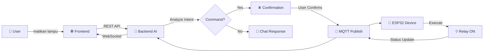

<div align="center">

# 🏠 Smart AI IoT Platform

### AI-Powered Smart Home Automation System

[](https://github.com/yourusername/smarthome-aiot)
[](https://github.com/yourusername/smarthome-aiot)
[](https://www.python.org/downloads/)
[](https://fastapi.tiangolo.com/)
[](LICENSE)

**Control your smart home devices with natural language using AI** 🤖💡

[Quick Start](#-quick-start) • [Features](#-features) • [Architecture](#-architecture) • [Documentation](#-documentation) • [Demo](#-demo)


</div>

---

## 🌟 Features

<table>
<tr>
<td width="50%">

### 🤖 AI-Powered Control
- Natural language commands with **Google Gemini**
- Smart intent classification (command vs conversation)
- Confirmation mechanism for safety
- Multi-language support (ID/EN)

</td>
<td width="50%">

### 🔌 IoT Integration
- **MQTT protocol** for real-time communication
- Support **ESP32** microcontrollers
- Relay control for lights, fans, appliances
- Bidirectional status updates

</td>
</tr>
<tr>
<td width="50%">

### ⚡ Real-Time Updates
- **WebSocket** for instant UI refresh
- Device status monitoring
- Low latency (~200-400ms end-to-end)
- Connection health tracking

</td>
<td width="50%">

### 🔐 Secure & Scalable
- **TLS/SSL** encryption for MQTT
- **JWT** authentication
- Rate limiting & CORS protection
- Scale from 10 to 10,000+ devices

</td>
</tr>
</table>

---

## 🎯 How It Works



### Example Flow

```bash
# User: "matikan lampu outdoor"
#   ↓
# AI: "Akan mematikan lampu outdoor. Lanjutkan?" [✓ Confirm] [✗ Cancel]
#   ↓ (User clicks Confirm)
# Backend: PUBLISH → mikohome/light_lamp_outdoor/set {"state":"off"}
#   ↓
# ESP32: digitalWrite(RELAY_PIN, LOW) → Lamp OFF
#   ↓
# ESP32: PUBLISH → mikohome/light_lamp_outdoor/status {"state":"off"}
#   ↓
# Frontend: 💡 Device card updates → "OFF" (grey icon)
```

---

## 🚀 Quick Start

### Prerequisites

<table>
<tr>
<td width="50%">

**Software**
- Python 3.11+
- Arduino IDE
- Git

</td>
<td width="50%">

**Hardware**
- ESP32 Dev Board
- 5V Relay Module
- Jumper wires

</td>
</tr>
<tr>
<td width="50%">

**Accounts**
- [Google Gemini API Key](https://aistudio.google.com/app/apikey)
- [HiveMQ Cloud](https://www.hivemq.com/mqtt-cloud-broker/) (free tier)

</td>
<td width="50%">

**Time Required**
- Backend setup: 10 min
- Hardware setup: 15 min
- Total: **~30 minutes**

</td>
</tr>
</table>

### 📥 Installation

```bash
# 1. Clone repository
git clone https://github.com/yourusername/smarthome-aiot.git
cd smarthome-aiot

# 2. Setup backend
cd backend
python -m venv venv
venv\Scripts\activate        # Windows
# source venv/bin/activate   # Linux/Mac
pip install -r requirements.txt

# 3. Configure environment
copy ..\.env.example .env
notepad .env  # Edit with your credentials

# 4. Initialize database
alembic upgrade head

# 5. Start server
python main.py
```

**Backend running at:** http://localhost:8000/docs 🎉

### 🔧 Hardware Setup

```cpp
// 1. Wiring (ESP32 → Relay Module)
GPIO 4  →  IN
GND     →  GND  
VIN     →  VCC

// 2. Configure (Hardware/config.h)
const char* WIFI_SSID = "YourWiFi";
const char* MQTT_BROKER = "xxx.s1.eu.hivemq.cloud";
const char* DEVICE_ID = "light_lamp_outdoor_001";  // Must be unique!

// 3. Upload sketch to ESP32
// 4. Monitor Serial: Should see "✓ WiFi Connected" + "✓ MQTT Connected"
```

### ✅ Verify Installation

```bash
# Test health check
curl http://localhost:8000/health

# Expected response:
{
  "status": "ok",
  "services": {
    "mqtt": "connected",
    "gemini": "ready"
  }
}
```

**📖 Detailed Setup Guide:** See [GETTING_STARTED.md](GETTING_STARTED.md)

---

## 📡 MQTT Topics Reference

### Topic Pattern

```
/{home_id}/{device_id}/{action}

Examples:
  mikohome/light_lamp_outdoor/set      ← Backend sends command
  mikohome/light_lamp_outdoor/status   ← Device reports status
```

### Payload Format

```json
{
  "state": "on",
  "timestamp": 1726318027
}
```

| Field | Type | Values | Description |
|-------|------|--------|-------------|
| `state` | string | `"on"` or `"off"` | Target state |
| `timestamp` | integer | Unix epoch | Command/status time |

### Communication Flow

```
Backend                 MQTT Broker              ESP32 Device
   │                         │                         │
   │  PUBLISH                │                         │
   ├────────────────────────→│                         │
   │  mikohome/lamp/set      │   FORWARD               │
   │  {"state":"on"}         ├────────────────────────→│
   │                         │                         │ digitalWrite(4, HIGH)
   │                         │                         │ Relay CLOSE → Lamp ON
   │                         │                         │
   │                         │      PUBLISH            │
   │                         │←────────────────────────┤
   │    FORWARD              │  mikohome/lamp/status   │
   │←────────────────────────┤  {"state":"on"}         │
   │                         │                         │
   │  Update DB + WebSocket  │                         │
```

---

## 🛠️ API Reference

**Base URL:** `http://localhost:8000/api/v1`

### Device Control

| Method | Endpoint | Description | Body |
|--------|----------|-------------|------|
| `GET` | `/homes/{home_id}/devices` | List all devices | - |
| `POST` | `/homes/{home_id}/devices/{device_id}/toggle` | Toggle device | `{"state":"on"}` |
| `POST` | `/homes/{home_id}/devices/{device_id}/timer` | Schedule timer | `{"action":"off","datetime":"..."}` |

### AI Chat

| Method | Endpoint | Description | Body |
|--------|----------|-------------|------|
| `POST` | `/homes/{home_id}/chat` | Send AI command | `{"message":"matikan lampu"}` |
| `POST` | `/homes/{home_id}/chat/confirm` | Confirm AI action | `{"action_id":"...","confirm":true}` |

### Response Types

**Type A: Confirmation Required**
```json
{
  "type": "confirmation_required",
  "action_id": "act_9f2a1b",
  "intent_summary": "Mematikan lampu outdoor",
  "proposed_action": {...},
  "expires_in": 60
}
```

**Type B: Chat Response**
```json
{
  "type": "chat",
  "message": "Lampu outdoor sedang menyala sejak 2 jam yang lalu."
}
```

**📖 Complete API Contract:** See [smart-ai-iot-job-spec-v3.md](smart-ai-iot-job-spec-v3.md) *(LOCKED)*

---

## 🏗️ Architecture

### System Components

```
┌──────────────────────────────────────────────────────┐
│                    Frontend (Web UI)                 │
│         Dashboard • Chat Interface • WebSocket       │
└────────────────┬─────────────────────────────────────┘
                 │ REST API + WebSocket
                 ▼
┌──────────────────────────────────────────────────────┐
│              Backend (Python FastAPI)                │
│  ┌──────────┐  ┌──────────┐  ┌──────────────────┐  │
│  │ REST API │  │ Gemini   │  │ MQTT Service     │  │
│  │ Routes   │  │ AI       │  │ (Async Client)   │  │
│  └──────────┘  └──────────┘  └──────────────────┘  │
│  ┌──────────────────────────────────────────────┐  │
│  │         SQLite / PostgreSQL Database         │  │
│  └──────────────────────────────────────────────┘  │
└────────────────┬─────────────────────────────────────┘
                 │ MQTT over TLS (8883)
                 ▼
┌──────────────────────────────────────────────────────┐
│            HiveMQ Cloud MQTT Broker                  │
│         Topic Routing • Message Persistence          │
└────────────────┬─────────────────────────────────────┘
                 │ MQTT over TLS (8883)
                 ▼
┌──────────────────────────────────────────────────────┐
│              ESP32 IoT Devices (C++)                 │
│   WiFi Client • MQTT Client • Relay Control (GPIO)   │
└──────────────────────────────────────────────────────┘
```

**📖 Detailed Architecture:** See [ARCHITECTURE.md](ARCHITECTURE.md)

---

## 📚 Documentation

| Document | Description | When to Read |
|----------|-------------|--------------|
| **[README.md](README.md)** | 👈 You are here | First time |
| **[GETTING_STARTED.md](GETTING_STARTED.md)** | Step-by-step setup (30 min) | Setup phase |
| **[ARCHITECTURE.md](ARCHITECTURE.md)** | System design & data flows | Understanding internals |
| **[smart-ai-iot-job-spec-v3.md](smart-ai-iot-job-spec-v3.md)** | API Contract *(LOCKED)* | API integration |

---

## 🔧 Common Commands

### Backend Operations

```bash
# Start development server
cd backend
python main.py

# Run database migration
alembic upgrade head

# Create new migration
alembic revision --autogenerate -m "description"

# Run tests
pytest

# Check logs
cat logs/app.log
```

### Device Management

```bash
# Register new device
curl -X POST http://localhost:8000/api/v1/homes/mikohome/devices \
  -H "Content-Type: application/json" \
  -d '{"device_id":"light_001","device_type":"relay","room":"living_room"}'

# Toggle device
curl -X POST http://localhost:8000/api/v1/homes/mikohome/devices/light_001/toggle \
  -H "Content-Type: application/json" \
  -d '{"state":"on"}'

# Test AI chat
curl -X POST http://localhost:8000/api/v1/homes/mikohome/chat \
  -H "Content-Type: application/json" \
  -d '{"message":"nyalakan lampu ruang tamu"}'
```

---

## 🐛 Troubleshooting

### Backend Issues

<details>
<summary><b>❌ MQTT connection failed</b></summary>

**Solution:**
1. Check `.env` credentials: `MQTT_BROKER`, `MQTT_USERNAME`, `MQTT_PASSWORD`
2. Verify HiveMQ cluster is running (login to HiveMQ Console)
3. Test port 8883: `telnet <broker>.s1.eu.hivemq.cloud 8883`
4. Check firewall allows outbound port 8883

</details>

<details>
<summary><b>❌ Gemini API error: PERMISSION_DENIED</b></summary>

**Solution:**
1. Verify `GEMINI_API_KEY` in `.env`
2. Check API key is active: https://aistudio.google.com/
3. Check quota not exceeded (free tier: 60 req/min)

</details>

### ESP32 Issues

<details>
<summary><b>❌ WiFi not connecting</b></summary>

**Solution:**
1. Check SSID/password in `config.h` (case-sensitive)
2. Ensure WiFi is 2.4GHz (ESP32 doesn't support 5GHz)
3. Move ESP32 closer to router
4. Check Serial Monitor (115200 baud) for error details

</details>

<details>
<summary><b>❌ MQTT connection failed (ESP32)</b></summary>

**Error Codes:**
- `rc=-2`: Network timeout → check internet connection
- `rc=-4`: Auth failed → check MQTT username/password
- `rc=-5`: Not authorized → check HiveMQ permissions

**Solution:** Verify `config.h` credentials match backend `.env`

</details>

<details>
<summary><b>❌ Relay not working</b></summary>

**Solution:**
1. Check wiring: GPIO 4 → Relay IN, GND → GND, VIN → VCC
2. Test manual: Add `digitalWrite(4, HIGH); delay(1000);` in `setup()`
3. Check relay voltage (should be 3.3V on GPIO when HIGH)
4. Try inverted logic: Some relays are active-LOW

</details>

---

## 🚀 Deployment (Production)

### Requirements

- **Database:** PostgreSQL 13+ (not SQLite)
- **Cache:** Redis 6+ (for action cache & WebSocket scaling)
- **MQTT:** HiveMQ Cloud Pro or self-hosted EMQX cluster
- **Server:** Linux server with systemd, nginx
- **SSL:** Let's Encrypt certificate

### Deployment Checklist

```bash
# 1. Environment
✅ Set DEBUG=false in .env
✅ Use PostgreSQL: DATABASE_URL=postgresql+asyncpg://...
✅ Use Redis: REDIS_URL=redis://localhost:6379/0
✅ Generate strong SECRET_KEY: openssl rand -hex 32

# 2. Database
✅ Run migrations: alembic upgrade head
✅ Create indexes on devices.home_id and devices.state

# 3. Web Server
✅ Setup nginx reverse proxy
✅ Configure SSL with certbot
✅ Setup systemd service for auto-restart

# 4. MQTT
✅ Enable TLS certificate validation (not setInsecure())
✅ Setup per-device credentials (not shared)
✅ Configure topic ACLs

# 5. Monitoring
✅ Setup logging to file + rotation
✅ Configure Prometheus metrics
✅ Setup alerting (email/Telegram)
```

---

## 🛡️ Security Best Practices

- ✅ **Never commit** `.env` or `config.h` files (already in `.gitignore`)
- ✅ **Use TLS** for MQTT (port 8883, not 1883)
- ✅ **Strong passwords** for MQTT broker
- ✅ **JWT tokens** for API authentication
- ✅ **Rate limiting** enabled (20 req/min per IP for chat)
- ✅ **Input validation** on all API endpoints
- ✅ **CORS** configured for specific origins only

---

## 🎓 Learning Resources

- **FastAPI Documentation:** https://fastapi.tiangolo.com/
- **MQTT Essentials:** https://www.hivemq.com/mqtt-essentials/
- **ESP32 Arduino Core:** https://docs.espressif.com/projects/arduino-esp32/
- **Google Gemini AI:** https://ai.google.dev/docs/function_calling

---

## 🗺️ Roadmap

- [ ] Support IR blaster (AC, TV remote control)
- [ ] Energy monitoring & analytics dashboard
- [ ] Mobile app (React Native)
- [ ] Voice control (Google Assistant, Alexa)
- [ ] Scene/automation builder (visual workflow)
- [ ] Multi-user with role management
- [ ] OTA firmware updates for ESP32
- [ ] Notification system (push, email, Telegram)

---

## 📄 License

**Proprietary** - Internal Use Only

---

## 🤝 Contributing

Contributions are welcome! Please:

1. Fork the repository
2. Create a feature branch (`git checkout -b feature/amazing-feature`)
3. Commit your changes (`git commit -m 'Add amazing feature'`)
4. Push to the branch (`git push origin feature/amazing-feature`)
5. Open a Pull Request

**Code Style:**
- Python: Black formatter, type hints required
- C++: Arduino style guide
- Commit messages: `<type>(<scope>): <description>`

---

## 💬 Support

- 📖 **Documentation:** Start with [GETTING_STARTED.md](GETTING_STARTED.md)
- 🐛 **Issues:** [GitHub Issues](https://github.com/yourusername/smarthome-aiot/issues)
- 💡 **Discussions:** [GitHub Discussions](https://github.com/yourusername/smarthome-aiot/discussions)

---

## 🙏 Acknowledgments

Built with:
- [FastAPI](https://fastapi.tiangolo.com/) - Modern Python web framework
- [Google Gemini](https://ai.google.dev/) - AI language model
- [HiveMQ Cloud](https://www.hivemq.com/) - MQTT broker
- [ESP32](https://www.espressif.com/en/products/socs/esp32) - IoT microcontroller

---

<div align="center">

**Made with ❤️ for Smart Home Automation**

⭐ Star this repo if you find it helpful!

[Back to Top](#-smart-ai-iot-platform)

</div>
